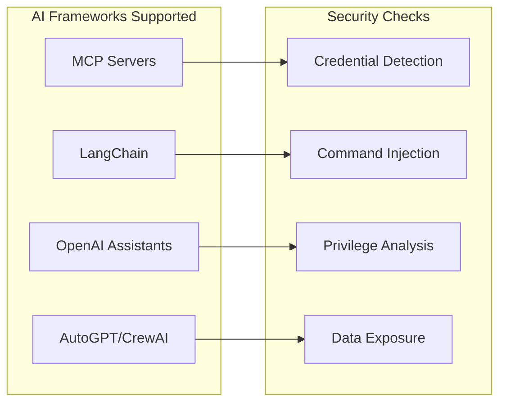
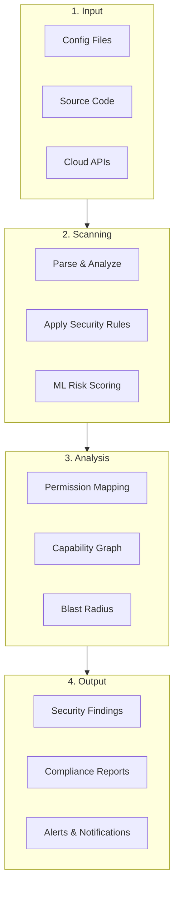

# SecureAgent

<div align="center">


**The First Comprehensive Security Platform for AI Agents & Cloud Infrastructure**

[](https://github.com/IParikh1/secureagent/actions/workflows/ci.yml)
[](https://www.python.org/downloads/)
[](https://opensource.org/licenses/MIT)
[]()

[Quick Start](#-quick-start) • [Features](#-key-features) • [Documentation](docs/) • [Examples](examples/)

</div>

---

## What is SecureAgent?

**SecureAgent** is a security scanning platform that protects your AI agents and cloud infrastructure. Think of it as a security guard that checks your AI systems for vulnerabilities before they become problems.

```
┌─────────────────────────────────────────────────────────────────────┐
│                         YOUR AI SYSTEMS                             │
│  ┌──────────┐  ┌──────────┐  ┌──────────┐  ┌──────────────────────┐ │
│  │   MCP    │  │LangChain │  │  OpenAI  │  │  Cloud (AWS/Azure)   │ │
│  │ Servers  │  │  Agents  │  │Assistants│  │     Resources        │ │
│  └────┬─────┘  └────┬─────┘  └────┬─────┘  └──────────┬───────────┘ │
│       │             │             │                   │             │
│       └─────────────┴──────┬──────┴───────────────────┘             │
│                            ▼                                        │
│                    ┌───────────────┐                                │
│                    │  SecureAgent  │                                │
│                    │   Scanner     │                                │
│                    └───────┬───────┘                                │
│                            ▼                                        │
│            ┌───────────────────────────────┐                        │
│            │  Security Findings & Reports  │                        │
│            │  • Vulnerabilities Found      │                        │
│            │  • Risk Scores                │                        │
│            │  • Compliance Status          │                        │
│            │  • Remediation Steps          │                        │
│            └───────────────────────────────┘                        │
└─────────────────────────────────────────────────────────────────────┘
```

## Why SecureAgent?

| Challenge | How SecureAgent Helps |
|-----------|----------------------|
| "I don't know what my AI agents can access" | **Inventory & Discovery** - Automatically finds and catalogs all your AI agents |
| "Are my MCP servers secure?" | **Security Scanning** - Checks for hardcoded credentials, command injection, and more |
| "What happens if an agent is compromised?" | **Blast Radius Analysis** - Shows exactly what could be affected |
| "Am I compliant with security standards?" | **Compliance Mapping** - Maps findings to OWASP, SOC2, PCI-DSS, HIPAA |
| "My cloud resources might be exposed" | **Cloud Scanning** - Checks AWS, Azure, and Terraform configurations |

---

## Quick Start

### Installation

```bash
# Install with pip
pip install secureagent

# Or install with all features
pip install secureagent[full]
```

### Your First Scan

```bash
# Scan an MCP configuration
secureagent scan ~/.config/claude/claude_desktop_config.json

# Scan a directory for AI agent vulnerabilities
secureagent scan ./my-project --scanners mcp,langchain

# Scan AWS infrastructure
secureagent cloud scan --provider aws
```

### Example Output

```
SecureAgent Security Report
═══════════════════════════════════════════════════════════════

Target: ~/.config/claude/claude_desktop_config.json
Scanners: MCP

Findings Summary
────────────────────────────────────────────────────────────────
  CRITICAL   1    ████████████████████
  HIGH       2    ████████████████████████████████████████
  MEDIUM     1    ████████████████████
  LOW        0

Findings
────────────────────────────────────────────────────────────────

[CRITICAL] MCP-001: Hardcoded Credential Detected
  Location: servers.filesystem.env.API_KEY

  A hardcoded API key was found in the configuration.
  This could allow unauthorized access if the config is exposed.

  Remediation: Use environment variables instead:
    API_KEY: "${API_KEY}"

[HIGH] MCP-002: Shell Command Pattern Detected
  Location: servers.shell-server.command

  The server can execute arbitrary shell commands.
  This is a high-risk capability that could be exploited.

  Remediation: Restrict commands using allowlists.
```

---

## Key Features

### 1. AI Agent Security Scanning

Scan configurations and code for security vulnerabilities across multiple AI frameworks:



### 2. AI Inventory & Discovery

Automatically discover and catalog all AI agents in your environment:

```bash
# Discover all agents
secureagent inventory discover ./project

# List all discovered agents
secureagent inventory list

# Show agent details
secureagent inventory show agent-001
```

### 3. Risk Analysis

Understand the security posture of your AI systems:

```bash
# Analyze permissions
secureagent analyze permissions agent-001

# Trace data flows
secureagent analyze data-flow agent-001

# Calculate blast radius
secureagent analyze risk agent-001
```

### 4. Cloud Security

Scan AWS, Azure, and Terraform for misconfigurations:

```bash
# Scan AWS
secureagent cloud scan --provider aws

# Scan Terraform files
secureagent scan ./terraform --scanners terraform
```

### 5. Compliance Reporting

Map findings to industry standards:

```bash
# Generate OWASP LLM Top 10 report
secureagent compliance report owasp-llm

# Generate SOC2 compliance status
secureagent compliance report soc2

# Export compliance report
secureagent compliance export --format html
```

---

## How It Works



See the [How It Works Guide](docs/how-it-works.md) for a detailed explanation.

---

## Documentation

| Document | Description | Audience |
|----------|-------------|----------|
| [Getting Started](docs/getting-started.md) | Installation and first steps | Everyone |
| [How It Works](docs/how-it-works.md) | Visual explanation of the system | Non-technical |
| [Architecture](docs/architecture.md) | System design and components | Technical |
| [Scanners Guide](docs/scanners.md) | Details on each scanner | Developers |
| [Compliance](docs/compliance.md) | Compliance frameworks | Security Teams |
| [CLI Reference](docs/cli-reference.md) | Complete command reference | Developers |
| [Integrations](docs/integrations.md) | GitHub, Slack, webhooks | DevOps |

---

## Integrations

### CI/CD Integration

```yaml
# GitHub Actions
- name: Security Scan
  uses: IParikh1/secureagent-action@v1
  with:
    path: ./
    scanners: mcp,langchain,aws
    fail-on: high
```

### Slack Notifications

```bash
# Set up Slack alerts
secureagent slack setup

# Test connection
secureagent slack test
```

### SARIF Output (GitHub Code Scanning)

```bash
# Generate SARIF for GitHub
secureagent scan ./ --format sarif --output results.sarif
```

---

## Output Formats

| Format | Use Case | Command |
|--------|----------|---------|
| Console | Interactive use | `--format console` |
| JSON | Programmatic access | `--format json` |
| SARIF | GitHub Code Scanning | `--format sarif` |
| HTML | Reports & sharing | `--format html` |

---

## Configuration

Create a `.secureagent.yaml` in your project:

```yaml
# Scanners to run
scanners:
  - mcp
  - langchain
  - aws

# Minimum severity to report
min_severity: medium

# Ignore specific rules
ignore_rules:
  - MCP-003  # Known false positive

# Alert configuration
alerts:
  slack:
    webhook_url: ${SLACK_WEBHOOK_URL}
    min_severity: high
```

---

## Contributing

We welcome contributions! See [CONTRIBUTING.md](CONTRIBUTING.md) for guidelines.

```bash
# Clone the repository
git clone https://github.com/IParikh1/secureagent.git
cd secureagent

# Install development dependencies
pip install -e ".[dev]"

# Run tests
pytest tests/ -v
```

---

## License

MIT License - see [LICENSE](LICENSE) for details.

---

## Support

- **Issues**: [GitHub Issues](https://github.com/IParikh1/secureagent/issues)
- **Discussions**: [GitHub Discussions](https://github.com/IParikh1/secureagent/discussions)

---

<div align="center">

**Built with security in mind for the AI-first world**

</div>
