# SecureAgent Architecture

This document provides a technical deep-dive into SecureAgent's architecture, designed for developers and security engineers who want to understand how the system works internally.

---

## Table of Contents

1. [System Overview](#system-overview)
2. [Core Components](#core-components)
3. [Data Flow](#data-flow)
4. [Scanner Architecture](#scanner-architecture)
5. [Analysis Engine](#analysis-engine)
6. [ML Pipeline](#ml-pipeline)
7. [Plugin System](#plugin-system)

---

## System Overview

SecureAgent is built as a modular, plugin-based architecture that allows for easy extension and customization.

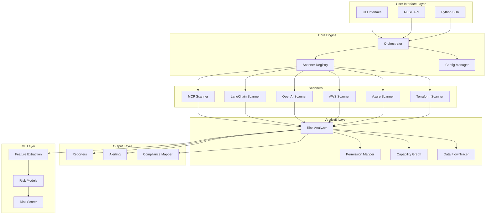

---

## Core Components

### 1. Unified Finding Model

All scanners produce findings in a standardized format:

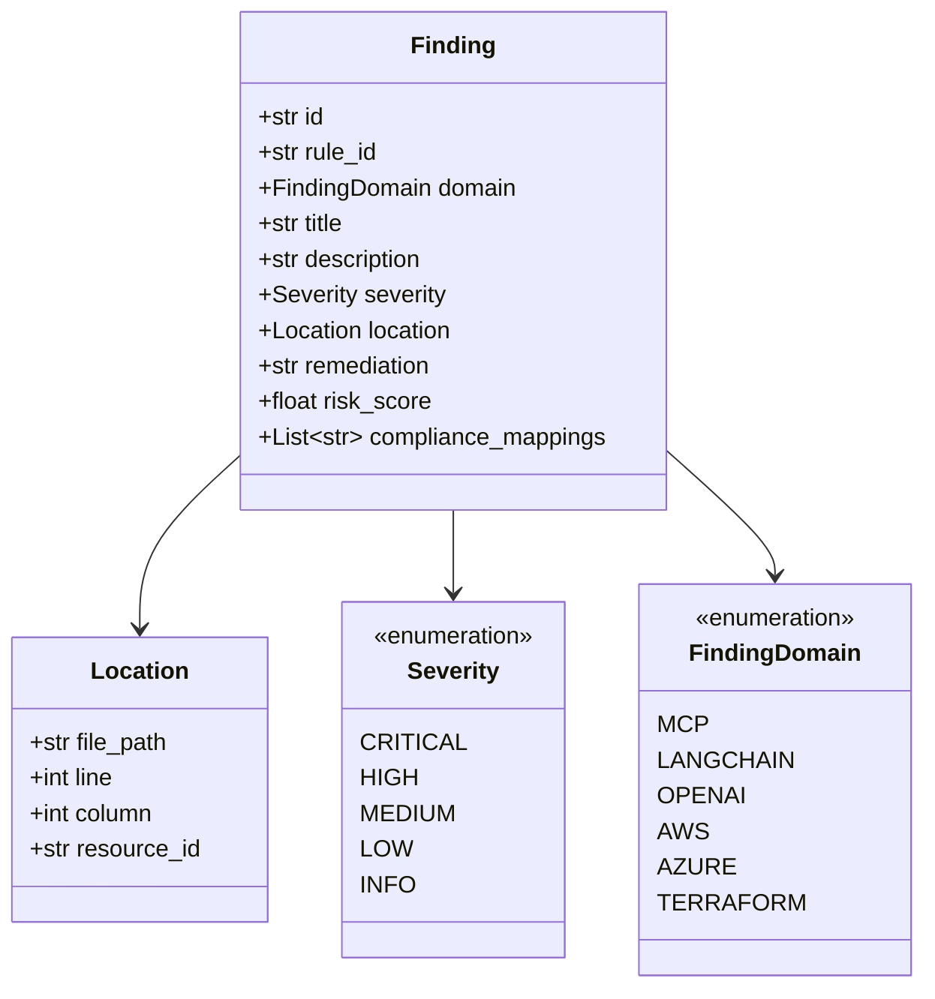

### 2. Scanner Registry

Scanners self-register using a plugin pattern:

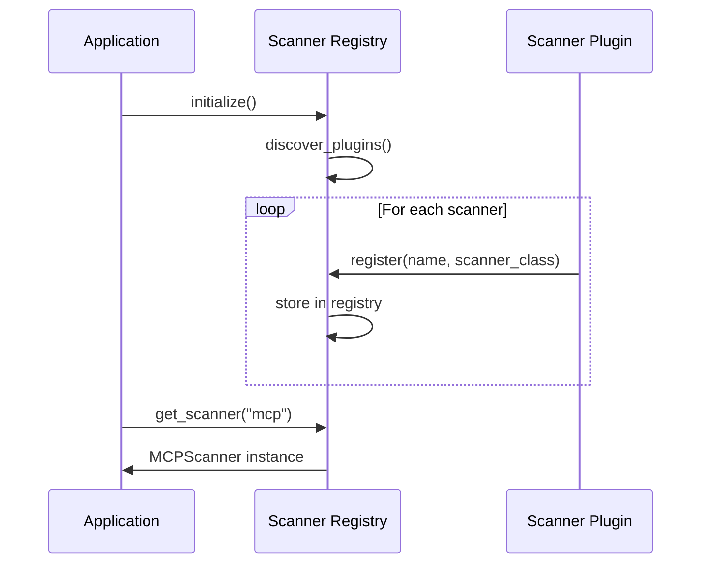

### 3. Configuration System

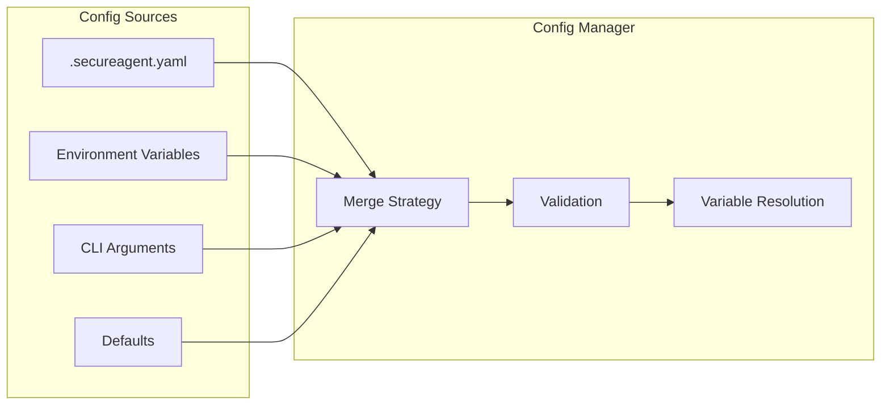

---

## Data Flow

### Complete Scan Flow

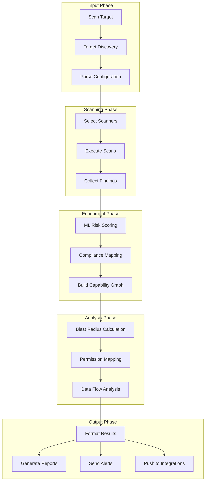

### Finding Processing Pipeline

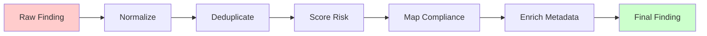

---

## Scanner Architecture

### Base Scanner Interface

All scanners implement the `BaseScanner` abstract class:

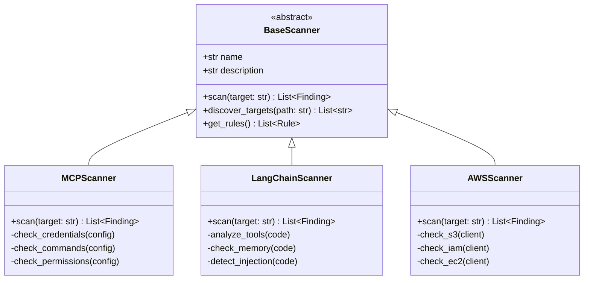

### Scanner Execution Model

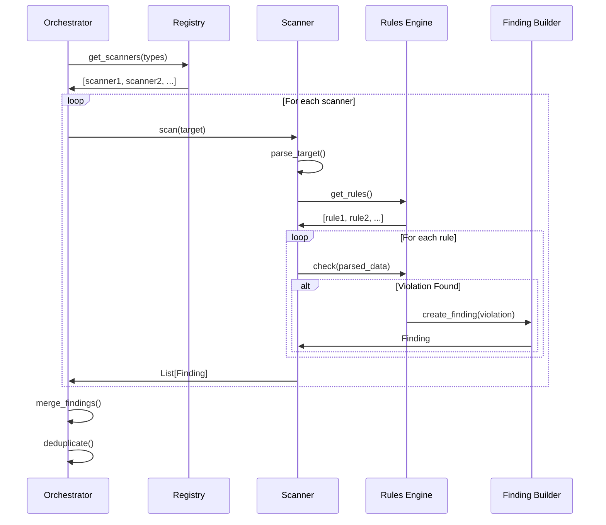

---

## Analysis Engine

### Capability Graph

The capability graph models relationships between agents, tools, and resources:

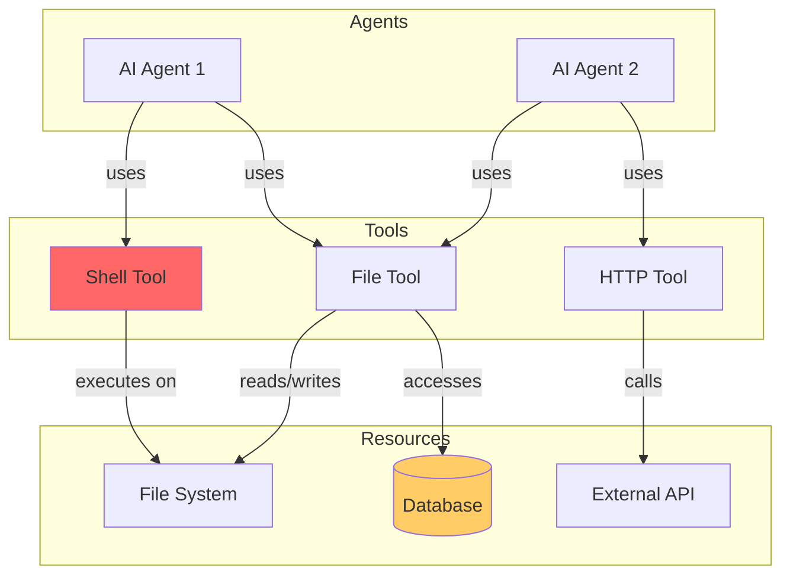

### Blast Radius Calculation

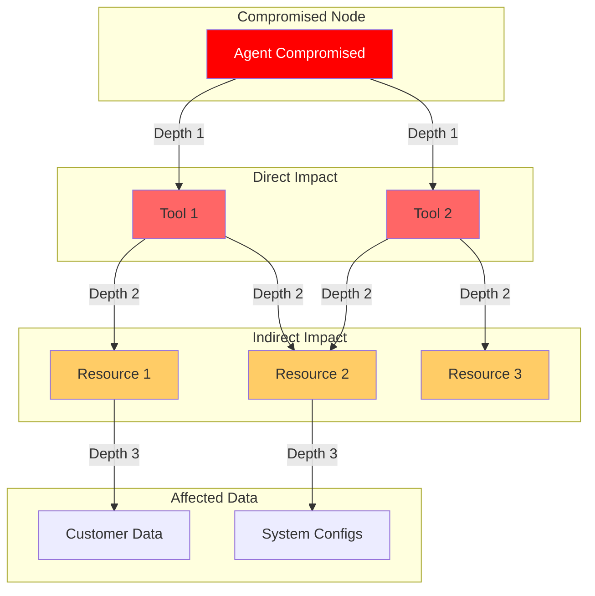

### Permission Analysis

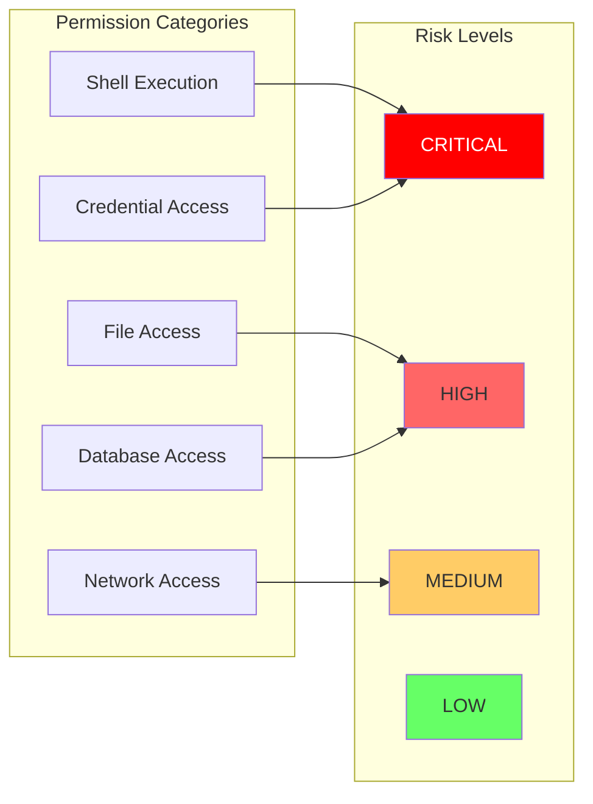

---

## ML Pipeline

### Risk Scoring Architecture

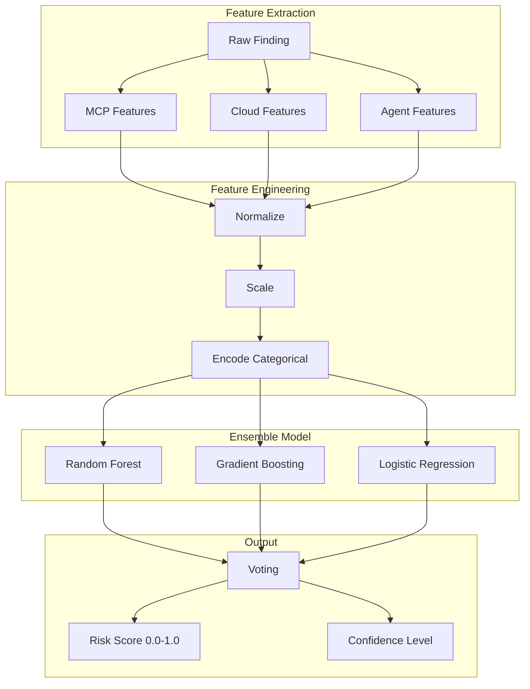

### Feature Categories

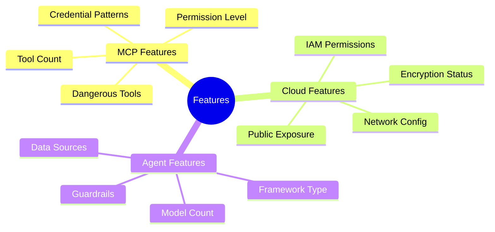

---

## Plugin System

### Adding a New Scanner

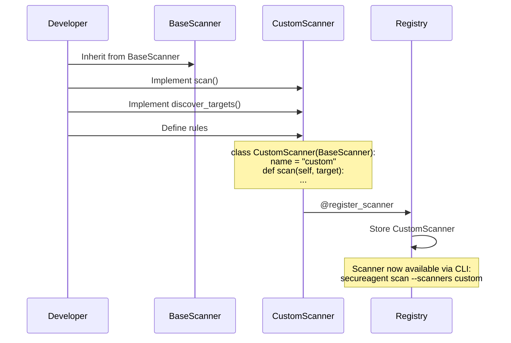

### Reporter Plugin Architecture

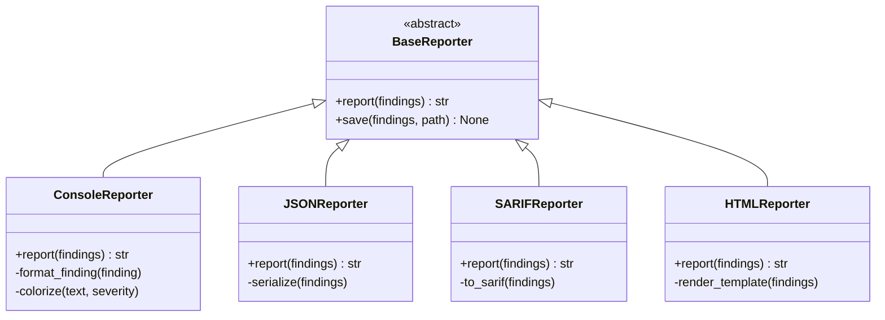

---

## Directory Structure

```
secureagent/
├── src/secureagent/
│   ├── cli/                 # Command-line interface
│   │   ├── app.py           # Main Typer application
│   │   ├── scan_commands.py # Scan subcommands
│   │   └── ...
│   │
│   ├── core/                # Core framework
│   │   ├── models/          # Data models (Finding, Agent, etc.)
│   │   ├── scanner/         # Base scanner & registry
│   │   ├── reporters/       # Output formatters
│   │   └── alerting/        # Alert dispatchers
│   │
│   ├── scanners/            # Security scanners
│   │   ├── mcp/             # MCP server scanner
│   │   ├── langchain/       # LangChain scanner
│   │   ├── aws/             # AWS cloud scanner
│   │   └── ...
│   │
│   ├── analysis/            # Analysis engines
│   │   ├── permissions.py   # Permission mapping
│   │   ├── risk_analyzer.py # Risk calculations
│   │   └── data_flow.py     # Data flow tracing
│   │
│   ├── graph/               # Capability graph
│   │   ├── models.py        # Graph data structures
│   │   ├── analyzer.py      # Graph analysis
│   │   └── visualizer.py    # Graph rendering
│   │
│   ├── ml/                  # Machine learning
│   │   ├── models.py        # ML models
│   │   ├── features/        # Feature extractors
│   │   └── risk_scorer.py   # Risk scoring
│   │
│   └── compliance/          # Compliance mapping
│       ├── frameworks/      # OWASP, SOC2, etc.
│       └── mapper.py        # Finding-to-control mapper
│
├── models/                  # Pre-trained ML models
├── tests/                   # Test suite
└── docs/                    # Documentation
```

---

## Performance Considerations

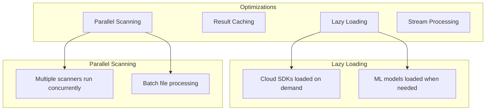

---

## Security Considerations

SecureAgent itself follows security best practices:

1. **No credential storage** - All credentials passed via environment variables
2. **Minimal permissions** - Only requests necessary cloud permissions
3. **Local processing** - Findings processed locally, no data sent externally
4. **Audit logging** - All operations logged for audit trail

---

## Next Steps

- [How It Works](how-it-works.md) - Non-technical overview
- [Scanners Guide](scanners.md) - Deep dive into each scanner
- [CLI Reference](cli-reference.md) - Complete command documentation
