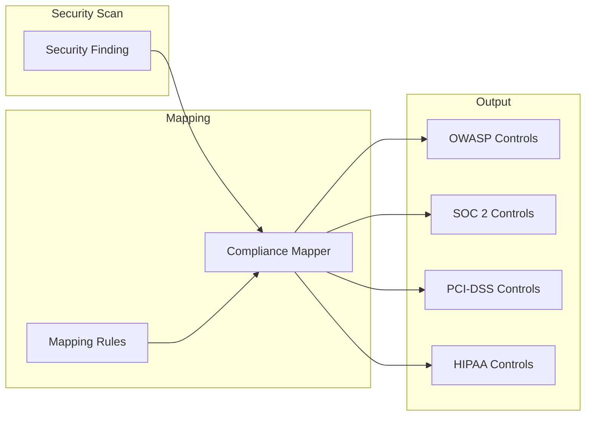
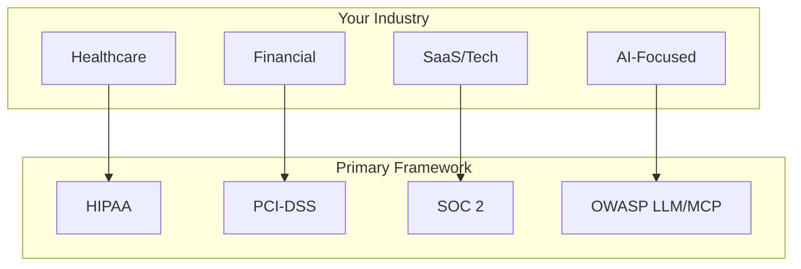
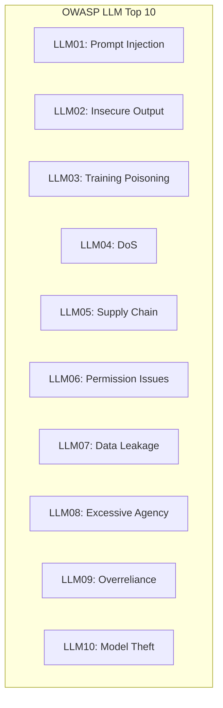
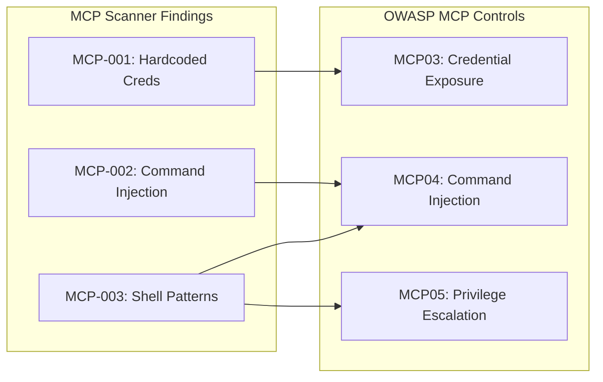
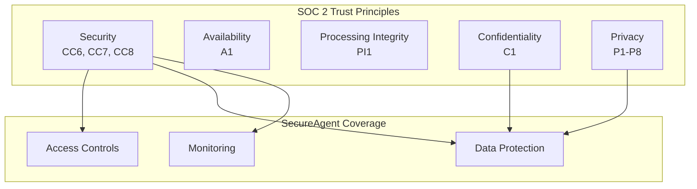
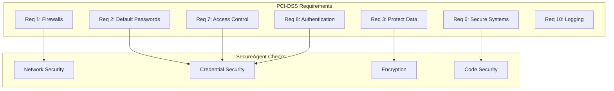
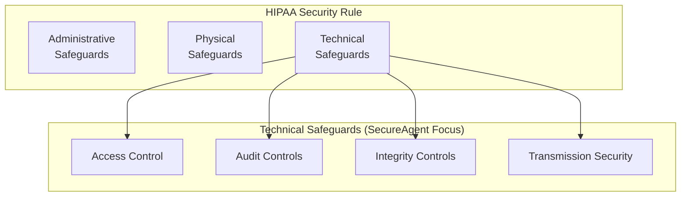
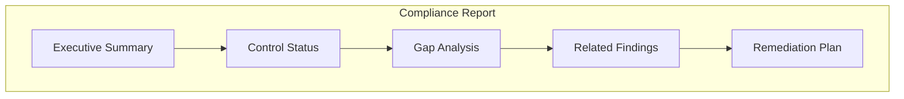
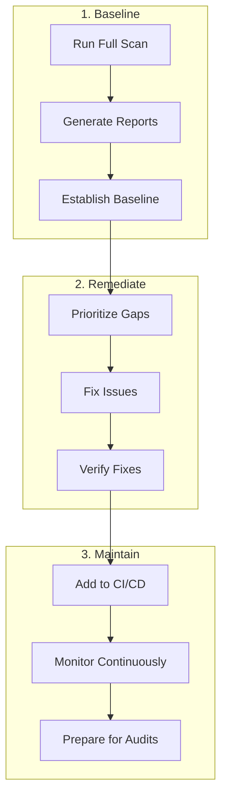

# Compliance Mapping Guide

SecureAgent maps security findings to industry compliance frameworks, helping you understand regulatory implications and prepare for audits.

---

## Table of Contents

1. [Overview](#overview)
2. [Supported Frameworks](#supported-frameworks)
3. [OWASP LLM Top 10](#owasp-llm-top-10)
4. [OWASP MCP Top 10](#owasp-mcp-top-10)
5. [SOC 2](#soc-2)
6. [PCI-DSS](#pci-dss)
7. [HIPAA](#hipaa)
8. [Using Compliance Reports](#using-compliance-reports)

---

## Overview

### How Compliance Mapping Works



### Why Compliance Mapping Matters

```
┌─────────────────────────────────────────────────────────────────┐
│                                                                 │
│   WITHOUT COMPLIANCE MAPPING          WITH COMPLIANCE MAPPING   │
│   ═════════════════════════          ════════════════════════   │
│                                                                 │
│   "You have 15 security             "You have 15 findings       │
│    findings"                          that affect:              │
│                                                                 │
│   ┌─────────────────────┐            • 3 OWASP LLM controls     │
│   │  Now what?          │            • 5 SOC 2 controls         │
│   │  Which matter?      │            • 2 PCI-DSS requirements   │
│   │  Am I compliant?    │                                       │
│   └─────────────────────┘            Your SOC 2 compliance:     │
│                                      [████████░░] 80%"          │
│                                                                 │
└─────────────────────────────────────────────────────────────────┘
```

---

## Supported Frameworks

| Framework | Focus Area | Best For |
|-----------|-----------|----------|
| **OWASP LLM Top 10** | AI/LLM security risks | AI applications |
| **OWASP MCP Top 10** | MCP server security | MCP deployments |
| **SOC 2** | Trust service criteria | SaaS companies |
| **PCI-DSS** | Payment card security | Payment processing |
| **HIPAA** | Health data protection | Healthcare |



---

## OWASP LLM Top 10

The OWASP Top 10 for Large Language Model Applications covers AI-specific security risks.

### Controls Overview



### Mapping Details

| Control | SecureAgent Rules | Description |
|---------|------------------|-------------|
| **LLM01** | MCP-002, LC-001 | Prompt and command injection |
| **LLM02** | LC-007, OAI-005 | Unvalidated output handling |
| **LLM06** | MCP-005, LC-001, LC-002 | Overly permissive agents |
| **LLM07** | MCP-001, LC-003, OAI-001 | Credential and data exposure |
| **LLM08** | MCP-003, LC-001, OAI-002 | Too much autonomous action |

### Example Report

```
╔═══════════════════════════════════════════════════════════════╗
║              OWASP LLM TOP 10 COMPLIANCE REPORT               ║
╠═══════════════════════════════════════════════════════════════╣
║                                                               ║
║   Control Status                                              ║
║   ──────────────                                              ║
║                                                               ║
║   LLM01 Prompt Injection      🔴 VIOLATION   2 findings       ║
║   LLM02 Insecure Output       🟢 COMPLIANT                    ║
║   LLM03 Training Poisoning    🟢 COMPLIANT                    ║
║   LLM04 Denial of Service     🟢 COMPLIANT                    ║
║   LLM05 Supply Chain          🟡 WARNING     1 finding        ║
║   LLM06 Permission Issues     🔴 VIOLATION   3 findings       ║
║   LLM07 Data Leakage          🔴 VIOLATION   1 finding        ║
║   LLM08 Excessive Agency      🟡 WARNING     2 findings       ║
║   LLM09 Overreliance          🟢 COMPLIANT                    ║
║   LLM10 Model Theft           🟢 COMPLIANT                    ║
║                                                               ║
║   Overall: 60% Compliant                                      ║
║                                                               ║
╚═══════════════════════════════════════════════════════════════╝
```

---

## OWASP MCP Top 10

Specific to Model Context Protocol server security.

### Controls Overview

| Control | Name | Description |
|---------|------|-------------|
| **MCP01** | Server Spoofing | Fake MCP server attacks |
| **MCP02** | Tool Poisoning | Malicious tool definitions |
| **MCP03** | Credential Exposure | Secrets in configs |
| **MCP04** | Command Injection | Shell command vulnerabilities |
| **MCP05** | Privilege Escalation | Unauthorized access |
| **MCP06** | Data Exfiltration | Unauthorized data transfer |
| **MCP07** | Insecure Communication | Unencrypted traffic |
| **MCP08** | Logging Failures | Missing audit trails |
| **MCP09** | Resource Exhaustion | DoS vulnerabilities |
| **MCP10** | Version Vulnerabilities | Outdated components |

### Mapping Flow



---

## SOC 2

SOC 2 (Service Organization Control 2) is essential for SaaS companies and service providers.

### Trust Service Criteria



### Key Control Mappings

| SOC 2 Control | Description | SecureAgent Rules |
|---------------|-------------|-------------------|
| **CC6.1** | Access to systems | MCP-005, AWS-IAM-001 |
| **CC6.6** | Manage credentials | MCP-001, LC-003 |
| **CC6.7** | Restrict access | AWS-S3-001, AWS-EC2-001 |
| **CC7.2** | Monitor for anomalies | All findings tracked |
| **CC8.1** | Change management | Terraform scans |
| **C1.2** | Confidential data | MCP-006, AWS-S3-003 |

### Example Mapping

```
Finding: MCP-001 Hardcoded Credential
├── SOC 2 Controls Affected:
│   ├── CC6.1 - Logical access security
│   ├── CC6.6 - Credential management
│   └── C1.2 - Confidential information protection
│
├── Compliance Status: VIOLATION
│
└── Remediation Required:
    Remove credentials from configuration files.
    Use environment variables or secret management.
```

---

## PCI-DSS

Payment Card Industry Data Security Standard for payment processing.

### Applicable Requirements



### Control Mappings

| PCI-DSS | Requirement | SecureAgent Rules |
|---------|-------------|-------------------|
| **1.3** | Restrict internet access | AWS-EC2-001, TF-SG-001 |
| **2.1** | Change defaults | AWS-IAM-002 |
| **3.4** | Render data unreadable | AWS-S3-003, TF-EC2-002 |
| **6.5.1** | Injection flaws | MCP-002, LC-004 |
| **6.5.10** | Broken auth | MCP-001, LC-003 |
| **7.1** | Limit access | MCP-005, AWS-IAM-001 |

---

## HIPAA

Health Insurance Portability and Accountability Act for healthcare data.

### Security Rule Categories



### Control Mappings

| HIPAA Control | Description | SecureAgent Rules |
|---------------|-------------|-------------------|
| **164.312(a)(1)** | Access control | All IAM/permission rules |
| **164.312(a)(2)(iv)** | Encryption | AWS-S3-003, TF-EC2-002 |
| **164.312(b)** | Audit controls | Logging-related findings |
| **164.312(c)(1)** | Integrity | Data protection findings |
| **164.312(d)** | Authentication | Credential findings |
| **164.312(e)(1)** | Transmission | Network exposure findings |

---

## Using Compliance Reports

### Generate Reports

```bash
# Generate OWASP LLM compliance report
secureagent compliance report owasp-llm

# Generate SOC 2 compliance status
secureagent compliance report soc2

# Check all frameworks
secureagent compliance status

# Show compliance gaps
secureagent compliance gaps
```

### Export Formats

```bash
# Export as HTML (for sharing)
secureagent compliance export --format html --output report.html

# Export as JSON (for automation)
secureagent compliance export --format json --output report.json

# Export as PDF (for auditors)
secureagent compliance export --format pdf --output report.pdf
```

### Report Structure



### Understanding Report Output

```
╔═══════════════════════════════════════════════════════════════╗
║                   SOC 2 COMPLIANCE REPORT                     ║
╠═══════════════════════════════════════════════════════════════╣
║                                                               ║
║   EXECUTIVE SUMMARY                                           ║
║   ─────────────────                                           ║
║   Scan Date: 2024-01-15                                       ║
║   Overall Compliance: 75%                                     ║
║   Critical Gaps: 3                                            ║
║                                                               ║
║   COMPLIANCE BY CATEGORY                                      ║
║   ──────────────────────                                      ║
║                                                               ║
║   Security (CC6-CC8)                                          ║
║   ├── CC6.1 Access Controls     🟢 COMPLIANT                  ║
║   ├── CC6.6 Credentials         🔴 VIOLATION                  ║
║   ├── CC6.7 Restrict Access     🔴 VIOLATION                  ║
║   └── CC7.2 Monitoring          🟢 COMPLIANT                  ║
║                                                               ║
║   Confidentiality (C1)                                        ║
║   └── C1.2 Protection           🟡 PARTIAL                    ║
║                                                               ║
║   GAP DETAILS                                                 ║
║   ───────────                                                 ║
║                                                               ║
║   CC6.6 - Credential Management                               ║
║   ┌─────────────────────────────────────────────────────┐    ║
║   │ Finding: MCP-001 Hardcoded credential in config     │    ║
║   │ Impact: Unauthorized access to systems              │    ║
║   │ Remediation: Use environment variables              │    ║
║   └─────────────────────────────────────────────────────┘    ║
║                                                               ║
╚═══════════════════════════════════════════════════════════════╝
```

---

## Compliance Workflow

### Recommended Process



### For Auditors

SecureAgent reports are designed to support audit processes:

1. **Evidence Collection** - All findings include timestamps and locations
2. **Remediation Tracking** - Track which issues were fixed
3. **Historical Data** - Export reports over time
4. **Control Mapping** - Direct mapping to framework controls

---

## Next Steps

- [Integrations](integrations.md) - Set up CI/CD and notifications
- [CLI Reference](cli-reference.md) - All compliance commands
- [Getting Started](getting-started.md) - Installation guide
