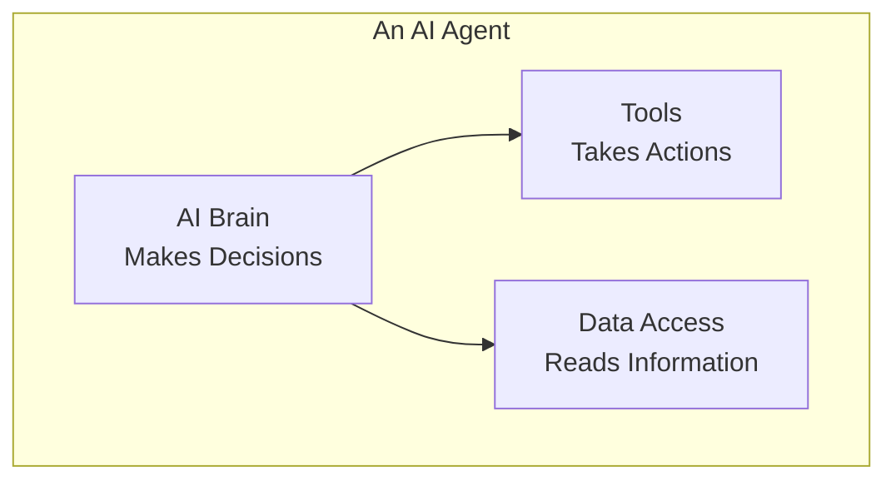
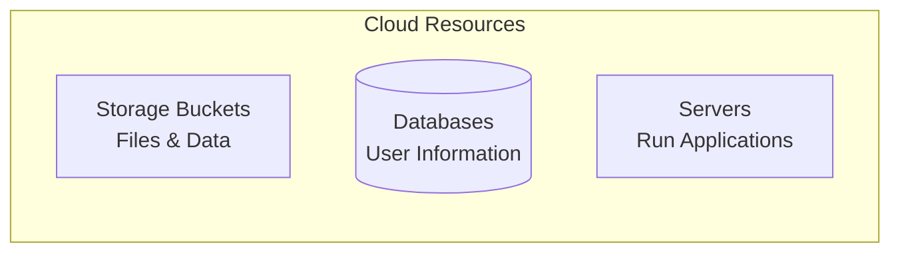
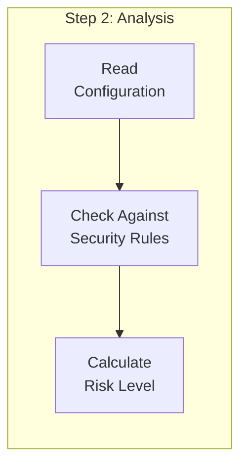
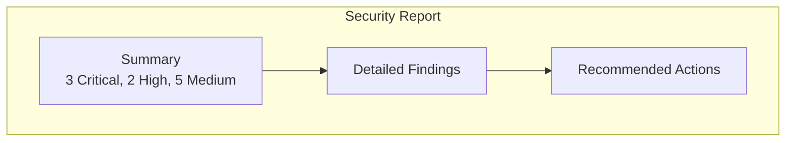
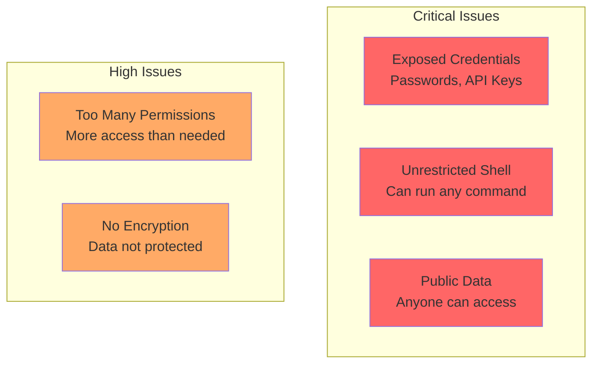
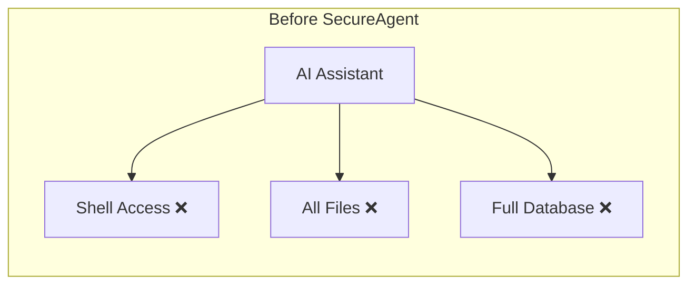
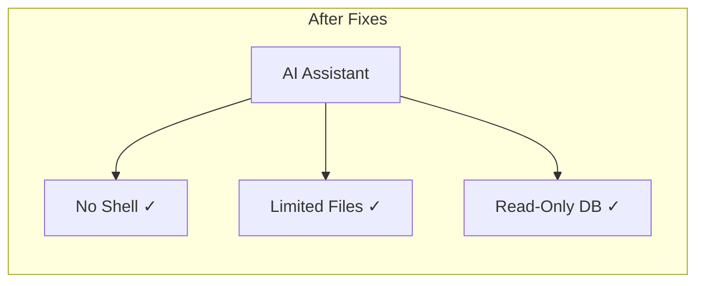
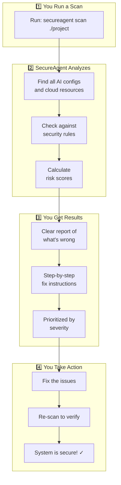

# How SecureAgent Works

**A Visual Guide for Everyone**

This guide explains how SecureAgent protects your AI systems using simple language and visual diagrams. No technical background required!

---

## Table of Contents

1. [The Big Picture](#the-big-picture)
2. [What Are We Protecting?](#what-are-we-protecting)
3. [How Scanning Works](#how-scanning-works)
4. [Understanding Risk Scores](#understanding-risk-scores)
5. [Reading Security Reports](#reading-security-reports)
6. [Real-World Examples](#real-world-examples)

---

## The Big Picture

Think of SecureAgent as a **security guard for your AI systems**. Just like a security guard checks for unlocked doors and suspicious activity, SecureAgent checks your AI agents and cloud systems for security problems.

```
┌─────────────────────────────────────────────────────────────────────────┐
│                                                                         │
│   YOUR AI SYSTEMS                          SECUREAGENT                  │
│   ══════════════                           ═══════════                  │
│                                                                         │
│   ┌─────────────┐                         ┌─────────────┐               │
│   │             │    "Let me check        │             │               │
│   │  AI Agents  │    these for you"       │  Security   │               │
│   │  & Cloud    │  ──────────────────►    │   Guard     │               │
│   │  Systems    │                         │             │               │
│   └─────────────┘                         └──────┬──────┘               │
│                                                  │                      │
│                                                  ▼                      │
│                                           ┌─────────────┐               │
│                                           │  "I found   │               │
│                                           │  3 issues   │               │
│                                           │  to fix!"   │               │
│                                           └─────────────┘               │
│                                                                         │
└─────────────────────────────────────────────────────────────────────────┘
```

---

## What Are We Protecting?

### AI Agents

AI agents are programs that use artificial intelligence to complete tasks. They can:
- Answer questions
- Write documents
- Execute commands
- Access databases
- Connect to the internet



**Why protect them?** If an AI agent has too much power or is misconfigured, it could:
- Leak sensitive information
- Execute harmful commands
- Access unauthorized data

### Cloud Resources

Cloud resources are computers and storage that run on services like AWS or Azure:



**Why protect them?** Misconfigurations can expose your data to the internet!

---

## How Scanning Works

### Step 1: Point SecureAgent at Your Systems

You tell SecureAgent what to check:

```
┌──────────────────────────────────────────────────────────┐
│                                                          │
│   YOU: "Check my AI configuration file"                  │
│                                                          │
│   ┌─────────────────────────────────────────────────┐    │
│   │ config.json                                     │    │
│   │ ─────────────                                   │    │
│   │ {                                               │    │
│   │   "ai_agent": {                                 │    │
│   │     "tools": ["shell", "files"],                │    │
│   │     "api_key": "sk-secret123"  ◄── Problem!    │    │
│   │   }                                             │    │
│   │ }                                               │    │
│   └─────────────────────────────────────────────────┘    │
│                                                          │
└──────────────────────────────────────────────────────────┘
```

### Step 2: SecureAgent Reads and Analyzes



SecureAgent has a list of **security rules** it checks against:

| Rule | What It Checks | Why It Matters |
|------|----------------|----------------|
| No hardcoded secrets | API keys in config files | Secrets can be stolen |
| Limit shell access | Agents that can run commands | Commands can be dangerous |
| Encrypt data | Storage without encryption | Data can be read by others |
| Restrict network | Public database access | Anyone could connect |

### Step 3: Findings Are Generated

When SecureAgent finds a problem, it creates a **finding**:

```
┌──────────────────────────────────────────────────────────┐
│                        FINDING                           │
├──────────────────────────────────────────────────────────┤
│                                                          │
│   Title:    Hardcoded API Key Found                      │
│   Severity: 🔴 CRITICAL                                  │
│   Location: config.json, line 5                          │
│                                                          │
│   What's wrong:                                          │
│   An API key is written directly in your config file.    │
│   If someone sees this file, they can use your key.      │
│                                                          │
│   How to fix it:                                         │
│   Use an environment variable instead:                   │
│   "api_key": "${API_KEY}"                                │
│                                                          │
└──────────────────────────────────────────────────────────┘
```

### Step 4: Report Is Created

All findings are combined into a report:



---

## Understanding Risk Scores

SecureAgent uses a **risk score** to help you prioritize what to fix first.

### Severity Levels

```
    CRITICAL  🔴  ████████████████████  Fix Immediately!
                  These are serious security holes

    HIGH      🟠  ████████████████      Fix Soon
                  These could cause problems

    MEDIUM    🟡  ████████████          Plan to Fix
                  These should be addressed

    LOW       🟢  ████████              Good to Fix
                  Minor improvements

    INFO      🔵  ████                  For Your Knowledge
                  Not a security issue
```

### What Makes Something Critical?



### The ML Risk Score

SecureAgent also calculates a **machine learning risk score** from 0.0 to 1.0:

```
    0.0                    0.5                    1.0
     │                      │                      │
     ▼                      ▼                      ▼
    LOW                  MEDIUM                  HIGH
    ═══                  ══════                  ════

    Safe                Moderate              Dangerous
    Configuration       Risk                  Configuration
```

This score considers:
- How many tools the agent has
- What kind of access it has
- Historical patterns of similar configurations

---

## Reading Security Reports

### Report Summary

The first thing you see is a summary:

```
╔═══════════════════════════════════════════════════════════════╗
║                    SECURITY SCAN RESULTS                       ║
╠═══════════════════════════════════════════════════════════════╣
║                                                                 ║
║   Target:    My AI Project                                      ║
║   Scanned:   15 files, 3 cloud resources                        ║
║   Duration:  2.3 seconds                                        ║
║                                                                 ║
║   ┌─────────────────────────────────────────────────────────┐  ║
║   │  FINDINGS SUMMARY                                        │  ║
║   │  ─────────────────                                       │  ║
║   │                                                          │  ║
║   │  🔴 CRITICAL:  1   ████                                  │  ║
║   │  🟠 HIGH:      3   ████████████                          │  ║
║   │  🟡 MEDIUM:    5   ████████████████████                  │  ║
║   │  🟢 LOW:       2   ████████                              │  ║
║   │                                                          │  ║
║   │  Total: 11 findings                                      │  ║
║   └─────────────────────────────────────────────────────────┘  ║
║                                                                 ║
╚═══════════════════════════════════════════════════════════════╝
```

### Individual Findings

Each finding tells you:

1. **What's wrong** - Clear description of the issue
2. **Where it is** - Exact file and line number
3. **Why it matters** - The potential impact
4. **How to fix it** - Step-by-step remediation

```
┌───────────────────────────────────────────────────────────────┐
│ 🔴 CRITICAL: Hardcoded Database Password                      │
├───────────────────────────────────────────────────────────────┤
│                                                               │
│ Location: config/database.yaml:12                             │
│                                                               │
│ WHAT'S WRONG                                                  │
│ ────────────                                                  │
│ A database password is written directly in your config        │
│ file: "password: supersecret123"                              │
│                                                               │
│ WHY IT MATTERS                                                │
│ ──────────────                                                │
│ Anyone who can see this file (including in version            │
│ control) can access your database.                            │
│                                                               │
│ HOW TO FIX IT                                                 │
│ ─────────────                                                 │
│ 1. Remove the password from the file                          │
│ 2. Set it as an environment variable:                         │
│    export DB_PASSWORD="supersecret123"                        │
│ 3. Update config to use the variable:                         │
│    password: ${DB_PASSWORD}                                   │
│                                                               │
└───────────────────────────────────────────────────────────────┘
```

---

## Real-World Examples

### Example 1: Protecting an AI Assistant

**Scenario:** You have an AI assistant that helps with customer support.



**SecureAgent finds:**
- Shell access is too broad
- Agent can read sensitive files
- Full database access when only read is needed



### Example 2: Securing Cloud Storage

**Scenario:** Your company uses AWS S3 buckets for file storage.

```
BEFORE SCAN                          AFTER FIXES
═══════════                          ═══════════

┌─────────────────┐                 ┌─────────────────┐
│   S3 Bucket     │                 │   S3 Bucket     │
│   ───────────   │                 │   ───────────   │
│                 │                 │                 │
│   🔓 Public     │   ──────►       │   🔒 Private    │
│   ❌ Unencrypted │                 │   ✓ Encrypted   │
│   ❌ No logging  │                 │   ✓ Logging on  │
│                 │                 │                 │
└─────────────────┘                 └─────────────────┘
```

### Example 3: AI Agent Permission Review

**Scenario:** You want to understand what your AI agents can do.

SecureAgent creates a **permission map**:

```
┌─────────────────────────────────────────────────────────────────┐
│                     AGENT PERMISSION MAP                         │
├─────────────────────────────────────────────────────────────────┤
│                                                                  │
│   Agent: Customer Support Bot                                    │
│                                                                  │
│   CAPABILITIES                        RISK LEVEL                 │
│   ────────────                        ──────────                 │
│                                                                  │
│   ✓ Read customer tickets             🟢 LOW                     │
│   ✓ Send email responses              🟢 LOW                     │
│   ✓ Access knowledge base             🟢 LOW                     │
│   ⚠ Write to database                 🟡 MEDIUM                  │
│   ❌ Execute shell commands            🔴 CRITICAL (Remove!)      │
│                                                                  │
│   RECOMMENDATION: Remove shell access - not needed for support   │
│                                                                  │
└─────────────────────────────────────────────────────────────────┘
```

---

## The Complete Flow

Here's everything together:



---

## Common Questions

### "What if I don't understand a finding?"

Each finding includes:
- Plain language description
- Why it matters
- Exact steps to fix

### "How often should I scan?"

We recommend:
- **On every code change** (in CI/CD)
- **Daily** for cloud resources
- **Before deployments**

### "What do I fix first?"

Priority order:
1. 🔴 **CRITICAL** - Fix immediately
2. 🟠 **HIGH** - Fix within 24 hours
3. 🟡 **MEDIUM** - Plan to fix this week
4. 🟢 **LOW** - Add to backlog

---

## Next Steps

- [Getting Started](getting-started.md) - Install and run your first scan
- [Scanners Guide](scanners.md) - Learn about different scanners
- [Compliance](compliance.md) - Understand compliance mapping

---

<div align="center">

**Questions?** Open an issue on [GitHub](https://github.com/IParikh1/secureagent/issues)

</div>
