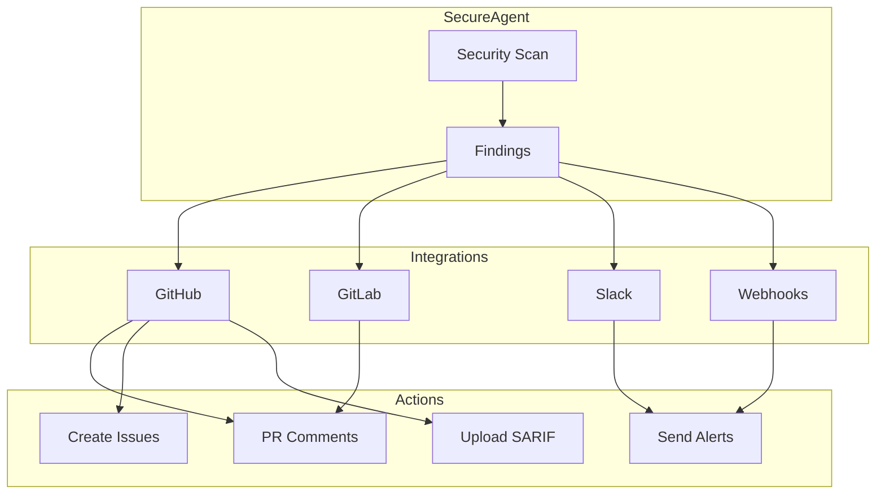
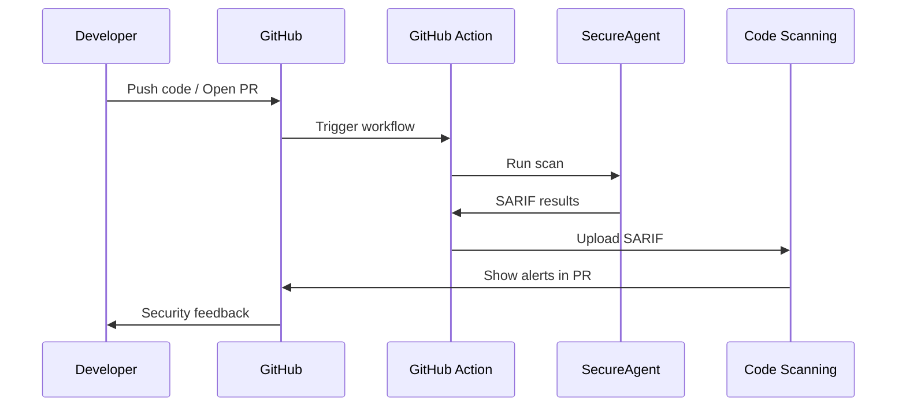
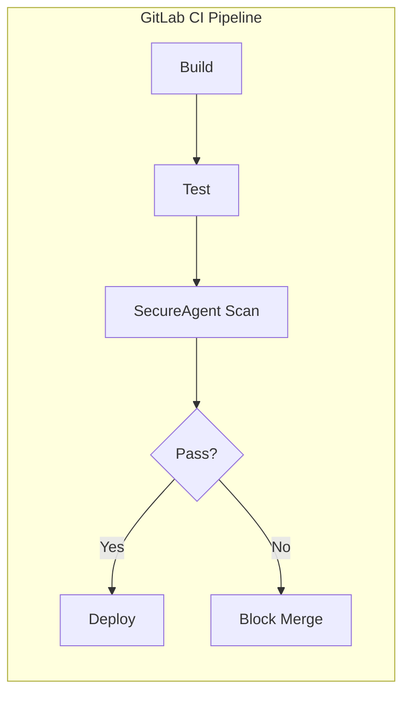
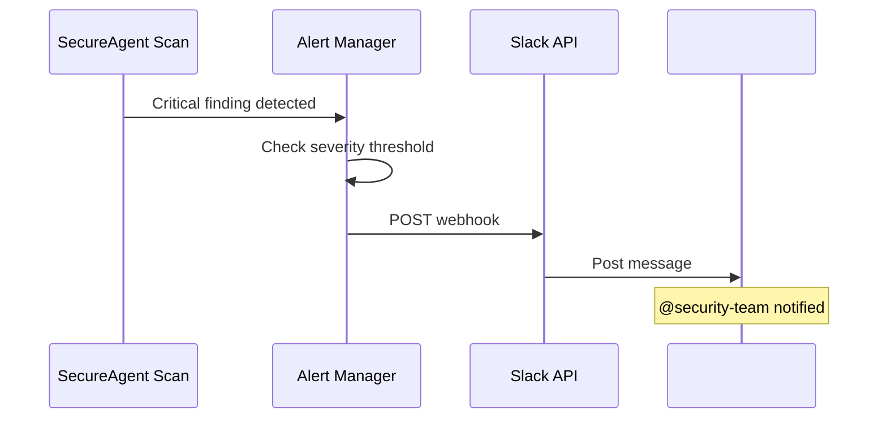
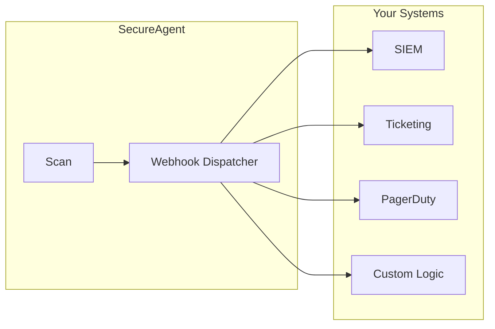
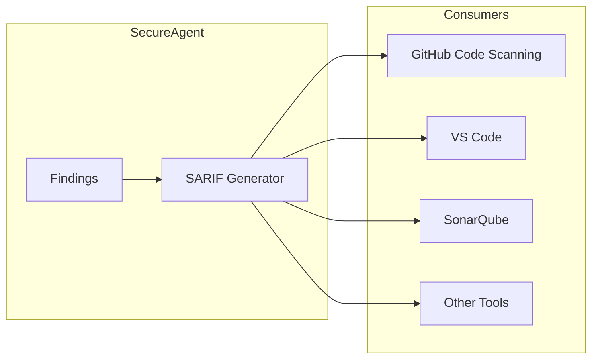
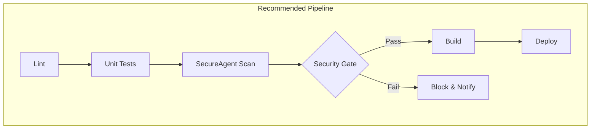

# Integrations Guide

SecureAgent integrates with your existing tools and workflows. This guide covers CI/CD pipelines, notification systems, and development platforms.

---

## Table of Contents

1. [Overview](#overview)
2. [GitHub Integration](#github-integration)
3. [GitLab Integration](#gitlab-integration)
4. [Slack Integration](#slack-integration)
5. [Webhooks](#webhooks)
6. [SARIF Output](#sarif-output)

---

## Overview

### Integration Architecture



### Integration Benefits

| Integration | Use Case |
|-------------|----------|
| **GitHub** | Automated PR checks, code scanning alerts |
| **GitLab** | CI/CD pipeline security gates |
| **Slack** | Real-time security notifications |
| **Webhooks** | Custom integrations |

---

## GitHub Integration

### GitHub Actions

Add SecureAgent to your CI/CD pipeline:

```yaml
# .github/workflows/security.yml
name: Security Scan

on:
  push:
    branches: [main]
  pull_request:
    branches: [main]

jobs:
  security-scan:
    runs-on: ubuntu-latest
    steps:
      - uses: actions/checkout@v4

      - name: Set up Python
        uses: actions/setup-python@v4
        with:
          python-version: '3.11'

      - name: Install SecureAgent
        run: pip install secureagent

      - name: Run Security Scan
        run: |
          secureagent scan . \
            --scanners mcp,langchain \
            --format sarif \
            --output results.sarif \
            --ci

      - name: Upload SARIF
        uses: github/codeql-action/upload-sarif@v2
        with:
          sarif_file: results.sarif
```

### Workflow Diagram



### PR Comments

SecureAgent can post comments directly on PRs:

```yaml
- name: Run Scan with PR Comments
  env:
    GITHUB_TOKEN: ${{ secrets.GITHUB_TOKEN }}
  run: |
    secureagent github scan . \
      --pr ${{ github.event.pull_request.number }}
```

**Example PR Comment:**

```markdown
## SecureAgent Security Scan

### Summary
| Severity | Count |
|----------|-------|
| 🔴 Critical | 1 |
| 🟠 High | 2 |
| 🟡 Medium | 3 |

### Critical Findings

#### MCP-001: Hardcoded Credential
📍 `config/mcp.json:15`

API key found in configuration file. Use environment variables instead.

**Suggested Fix:**
\```diff
- "api_key": "sk-abc123..."
+ "api_key": "${API_KEY}"
\```

---
*🔒 Scanned by SecureAgent*
```

### Auto-Create Issues

Create GitHub issues for critical findings:

```yaml
- name: Create Issues for Critical Findings
  env:
    GITHUB_TOKEN: ${{ secrets.GITHUB_TOKEN }}
  run: |
    secureagent github scan . \
      --create-issues \
      --issue-severity critical,high
```

### Fail on Severity

Block merges for security issues:

```yaml
- name: Security Gate
  run: |
    secureagent scan . --ci --fail-on high
  # Exit code 1 if HIGH or CRITICAL findings exist
```

---

## GitLab Integration

### GitLab CI/CD

```yaml
# .gitlab-ci.yml
stages:
  - test
  - security

security-scan:
  stage: security
  image: python:3.11
  script:
    - pip install secureagent
    - secureagent scan . --format json --output gl-sast-report.json --ci
  artifacts:
    reports:
      sast: gl-sast-report.json
    when: always
  rules:
    - if: $CI_PIPELINE_SOURCE == "merge_request_event"
    - if: $CI_COMMIT_BRANCH == $CI_DEFAULT_BRANCH
```

### Pipeline Visualization



### Merge Request Integration

```yaml
security-mr-scan:
  stage: security
  script:
    - pip install secureagent
    - |
      secureagent gitlab scan . \
        --mr $CI_MERGE_REQUEST_IID \
        --comment
  rules:
    - if: $CI_MERGE_REQUEST_IID
```

---

## Slack Integration

### Setup

```bash
# Configure Slack webhook
secureagent slack setup

# Test connection
secureagent slack test

# Check status
secureagent slack status
```

### Configuration

```yaml
# .secureagent.yaml
alerts:
  slack:
    webhook_url: ${SLACK_WEBHOOK_URL}
    channel: "#security-alerts"
    min_severity: high
    mention_on_critical: "@security-team"
```

### Alert Flow



### Alert Message Format

```
┌─────────────────────────────────────────────────────────────┐
│ 🚨 SecureAgent Security Alert                               │
├─────────────────────────────────────────────────────────────┤
│                                                             │
│ *CRITICAL: Hardcoded Credential Detected*                   │
│                                                             │
│ 📍 Location: `config/mcp.json:15`                           │
│ 🏷️ Rule: MCP-001                                            │
│ 📊 Risk Score: 0.95                                         │
│                                                             │
│ An API key was found hardcoded in the configuration.        │
│                                                             │
│ *Remediation:*                                              │
│ Use environment variables instead of hardcoded values.      │
│                                                             │
│ [View Details] [Ignore] [Mark Fixed]                        │
│                                                             │
└─────────────────────────────────────────────────────────────┘
```

### Slack Bot Commands

If using the Slack bot (not just webhooks):

```
/secureagent scan <repo>     - Scan a repository
/secureagent status          - Get current security status
/secureagent findings        - List recent findings
/secureagent compliance      - Show compliance summary
```

---

## Webhooks

### Generic Webhook Configuration

```yaml
# .secureagent.yaml
alerts:
  webhooks:
    - url: https://your-service.com/security-webhook
      method: POST
      headers:
        Authorization: "Bearer ${WEBHOOK_TOKEN}"
        Content-Type: "application/json"
      min_severity: medium
      events:
        - finding_created
        - scan_complete
```

### Webhook Payload

```json
{
  "event": "finding_created",
  "timestamp": "2024-01-15T10:30:00Z",
  "scan_id": "scan-abc123",
  "finding": {
    "id": "finding-xyz789",
    "rule_id": "MCP-001",
    "severity": "critical",
    "title": "Hardcoded Credential Detected",
    "description": "API key found in configuration",
    "location": {
      "file": "config/mcp.json",
      "line": 15
    },
    "risk_score": 0.95,
    "compliance": {
      "owasp_llm": ["LLM07"],
      "soc2": ["CC6.6"]
    }
  }
}
```

### Custom Integration Example

```python
# Example: Custom webhook receiver
from flask import Flask, request

app = Flask(__name__)

@app.route('/security-webhook', methods=['POST'])
def handle_webhook():
    data = request.json

    if data['event'] == 'finding_created':
        finding = data['finding']

        if finding['severity'] == 'critical':
            # Page on-call engineer
            page_oncall(finding)

        # Log to SIEM
        log_to_siem(finding)

        # Create ticket
        create_jira_ticket(finding)

    return {'status': 'ok'}
```

### Webhook Flow



---

## SARIF Output

### What is SARIF?

SARIF (Static Analysis Results Interchange Format) is a standard format for static analysis tools.



### Generate SARIF

```bash
# Generate SARIF output
secureagent scan . --format sarif --output results.sarif

# With all metadata
secureagent scan . \
  --format sarif \
  --output results.sarif \
  --include-fixes \
  --include-compliance
```

### SARIF Structure

```json
{
  "$schema": "https://raw.githubusercontent.com/oasis-tcs/sarif-spec/master/Schemata/sarif-schema-2.1.0.json",
  "version": "2.1.0",
  "runs": [
    {
      "tool": {
        "driver": {
          "name": "SecureAgent",
          "version": "1.0.0",
          "rules": [
            {
              "id": "MCP-001",
              "name": "HardcodedCredential",
              "shortDescription": {
                "text": "Hardcoded credential detected"
              },
              "defaultConfiguration": {
                "level": "error"
              }
            }
          ]
        }
      },
      "results": [
        {
          "ruleId": "MCP-001",
          "level": "error",
          "message": {
            "text": "API key found in configuration file"
          },
          "locations": [
            {
              "physicalLocation": {
                "artifactLocation": {
                  "uri": "config/mcp.json"
                },
                "region": {
                  "startLine": 15
                }
              }
            }
          ]
        }
      ]
    }
  ]
}
```

### GitHub Code Scanning Integration

```yaml
- name: Upload to GitHub Code Scanning
  uses: github/codeql-action/upload-sarif@v2
  with:
    sarif_file: results.sarif
    category: secureagent
```

This creates alerts in the Security tab:

```
┌─────────────────────────────────────────────────────────────┐
│ GitHub Security > Code Scanning Alerts                      │
├─────────────────────────────────────────────────────────────┤
│                                                             │
│ 🔴 MCP-001: Hardcoded Credential Detected                   │
│    config/mcp.json:15                                       │
│    Opened 2 hours ago • SecureAgent                         │
│                                                             │
│ 🟠 LC-001: Shell Tool Usage                                 │
│    agents/support.py:42                                     │
│    Opened 2 hours ago • SecureAgent                         │
│                                                             │
└─────────────────────────────────────────────────────────────┘
```

---

## Integration Matrix

| Feature | GitHub | GitLab | Slack | Webhook |
|---------|--------|--------|-------|---------|
| CI/CD Pipeline | ✓ | ✓ | - | - |
| PR/MR Comments | ✓ | ✓ | - | - |
| Real-time Alerts | - | - | ✓ | ✓ |
| Issue Creation | ✓ | ✓ | - | Custom |
| Code Scanning | ✓ (SARIF) | ✓ | - | - |
| Interactive Bot | - | - | ✓ | - |

---

## Best Practices

### CI/CD Pipeline



### Alert Configuration

```yaml
# Production-recommended settings
alerts:
  slack:
    # Only alert on actionable items
    min_severity: high
    # Avoid alert fatigue
    deduplicate: true
    # Group similar findings
    batch_interval: 300  # 5 minutes

  webhooks:
    - url: ${SIEM_WEBHOOK}
      # Send everything to SIEM for logging
      min_severity: info
```

---

## Next Steps

- [CLI Reference](cli-reference.md) - All integration commands
- [Getting Started](getting-started.md) - Installation guide
- [Compliance](compliance.md) - Compliance reporting
