# Scanners Guide

SecureAgent includes multiple specialized scanners for different types of AI systems and cloud infrastructure. This guide explains how each scanner works and what it checks.

---

## Table of Contents

1. [Scanner Overview](#scanner-overview)
2. [MCP Scanner](#mcp-scanner)
3. [LangChain Scanner](#langchain-scanner)
4. [OpenAI Assistants Scanner](#openai-assistants-scanner)
5. [AWS Scanner](#aws-scanner)
6. [Azure Scanner](#azure-scanner)
7. [Terraform Scanner](#terraform-scanner)

---

## Scanner Overview

### How Scanners Work

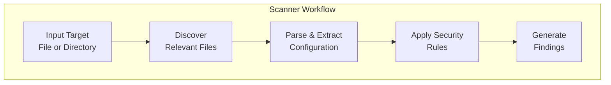

### Available Scanners

| Scanner | Target | Key Checks |
|---------|--------|------------|
| **MCP** | MCP server configs | Credentials, shell commands, permissions |
| **LangChain** | Python code | Dangerous tools, API keys, memory leaks |
| **OpenAI** | Python code | Code interpreter, function calls, file access |
| **AWS** | Live AWS account | S3, IAM, EC2, security groups |
| **Azure** | Live Azure account | Storage, Key Vault, networking |
| **Terraform** | `.tf` files | IaC misconfigurations |

### Running Multiple Scanners

```bash
# Run specific scanners
secureagent scan ./project --scanners mcp,langchain

# Run all scanners
secureagent scan ./project --scanners all
```

---

## MCP Scanner

The MCP (Model Context Protocol) scanner analyzes MCP server configurations for security issues.

### What It Scans

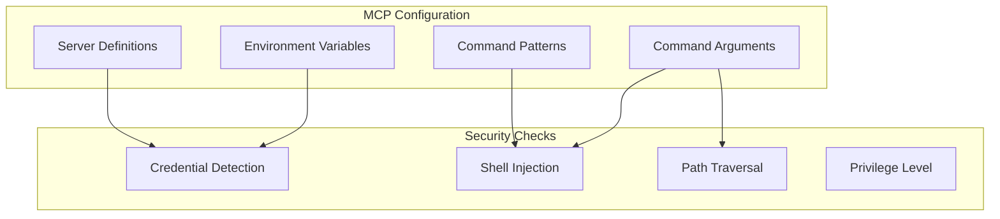

### Security Rules

| Rule ID | Name | Severity | Description |
|---------|------|----------|-------------|
| MCP-001 | Hardcoded Credentials | CRITICAL | API keys or passwords in config |
| MCP-002 | Command Injection | CRITICAL | Untrusted input in commands |
| MCP-003 | Shell Command Patterns | HIGH | Dangerous shell commands |
| MCP-004 | Path Traversal | HIGH | `../` patterns in paths |
| MCP-005 | Overly Permissive | MEDIUM | Too many capabilities |
| MCP-006 | Sensitive Env Vars | MEDIUM | Sensitive data in environment |
| MCP-007 | No Input Validation | LOW | Missing validation rules |

### How It Works

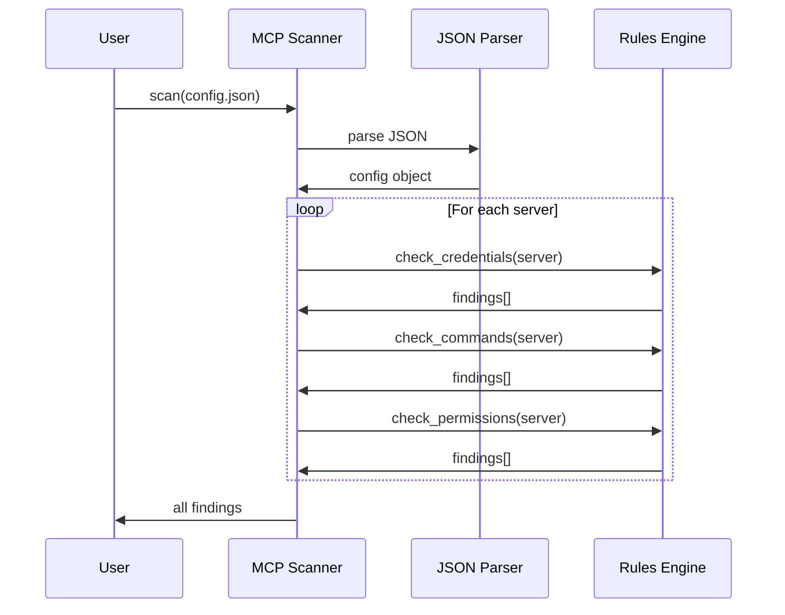

### Example Findings

**Hardcoded Credential:**
```json
{
  "mcpServers": {
    "database": {
      "command": "db-server",
      "env": {
        "DB_PASSWORD": "supersecret123"  // ❌ Hardcoded!
      }
    }
  }
}
```

**Fix:** Use environment variable reference:
```json
"DB_PASSWORD": "${DB_PASSWORD}"  // ✓ Safe
```

### Command Line

```bash
# Scan MCP config
secureagent mcp scan ~/.config/claude/claude_desktop_config.json

# Validate config structure
secureagent mcp validate config.json

# Auto-fix issues
secureagent mcp fix config.json
```

---

## LangChain Scanner

The LangChain scanner analyzes Python code that uses the LangChain framework.

### What It Scans

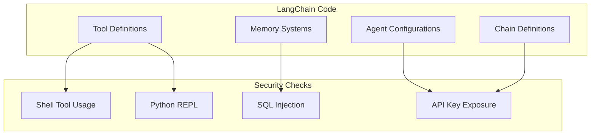

### Security Rules

| Rule ID | Name | Severity | Description |
|---------|------|----------|-------------|
| LC-001 | Shell Tool | CRITICAL | Unrestricted shell execution |
| LC-002 | Python REPL | CRITICAL | Arbitrary code execution |
| LC-003 | Hardcoded API Key | CRITICAL | API keys in source code |
| LC-004 | SQL Database | HIGH | Potential SQL injection |
| LC-005 | Unencrypted Memory | HIGH | Sensitive data in memory |
| LC-006 | File System Tool | HIGH | Unrestricted file access |
| LC-007 | Verbose Mode | MEDIUM | Debug output exposed |

### Detection Patterns

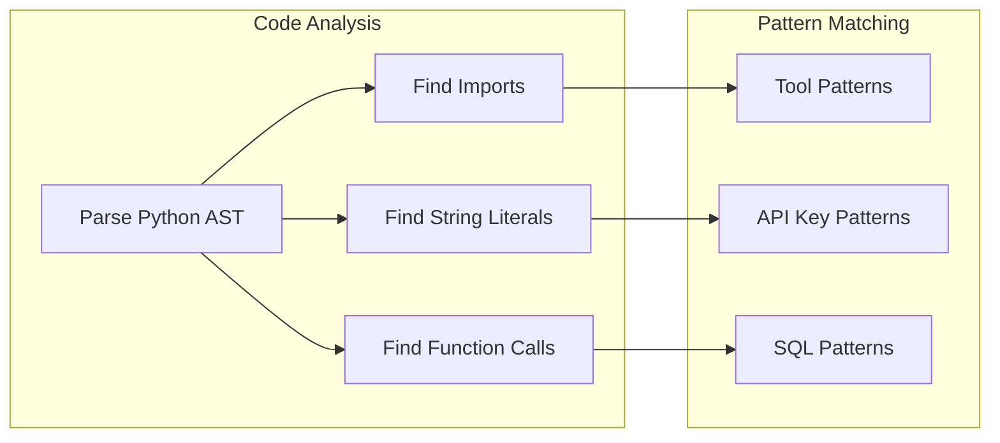

### Example Findings

**Dangerous Tool:**
```python
from langchain.tools import ShellTool

agent = initialize_agent(
    tools=[ShellTool()],  # ❌ Full shell access!
    llm=llm
)
```

**Hardcoded API Key:**
```python
openai_api_key = "sk-abc123..."  # ❌ Exposed!
```

### Command Line

```bash
# Scan Python files
secureagent scan ./my_agent.py --scanners langchain

# Scan directory
secureagent scan ./langchain_project --scanners langchain
```

---

## OpenAI Assistants Scanner

Scans code that uses OpenAI's Assistants API for security issues.

### What It Scans

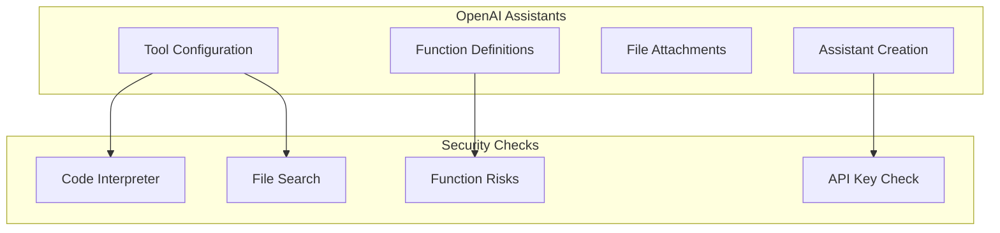

### Security Rules

| Rule ID | Name | Severity | Description |
|---------|------|----------|-------------|
| OAI-001 | Hardcoded API Key | CRITICAL | OpenAI key in code |
| OAI-002 | Code Interpreter | HIGH | Arbitrary code execution |
| OAI-003 | File Search | MEDIUM | Access to uploaded files |
| OAI-004 | Dangerous Function | HIGH | Risky function calls |
| OAI-005 | Missing Instructions | MEDIUM | No safety instructions |
| OAI-006 | Retrieval Enabled | MEDIUM | Knowledge retrieval active |

### Tool Risk Assessment

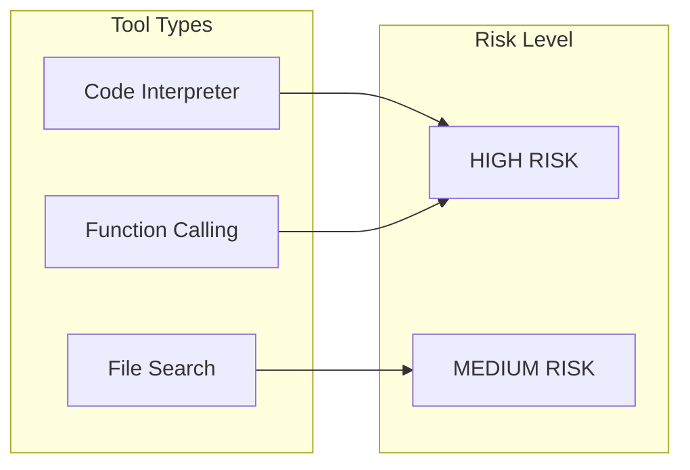

### Example Findings

**Code Interpreter Risk:**
```python
assistant = client.beta.assistants.create(
    tools=[{"type": "code_interpreter"}],  # ⚠️ Can run arbitrary code
    model="gpt-4"
)
```

### Command Line

```bash
# Scan for OpenAI patterns
secureagent scan ./assistant.py --scanners openai
```

---

## AWS Scanner

Scans your live AWS account for security misconfigurations.

### What It Scans

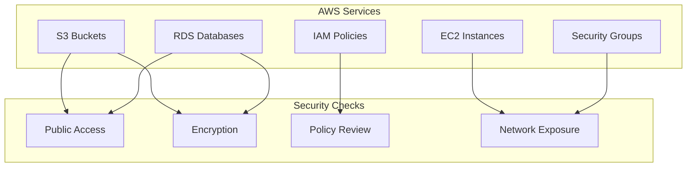

### Security Rules

| Rule ID | Name | Severity | Description |
|---------|------|----------|-------------|
| AWS-S3-001 | Public Bucket | CRITICAL | Bucket accessible to everyone |
| AWS-S3-002 | Public ACL | HIGH | ACL allows public access |
| AWS-S3-003 | No Encryption | MEDIUM | Bucket not encrypted |
| AWS-IAM-001 | Admin Policy | HIGH | Overly permissive policy |
| AWS-IAM-002 | No MFA | HIGH | Root/admin without MFA |
| AWS-EC2-001 | Public SG | HIGH | Security group open to 0.0.0.0/0 |
| AWS-EC2-002 | SSH Exposed | CRITICAL | SSH open to internet |
| AWS-EC2-003 | DB Exposed | CRITICAL | Database port exposed |

### Scan Flow

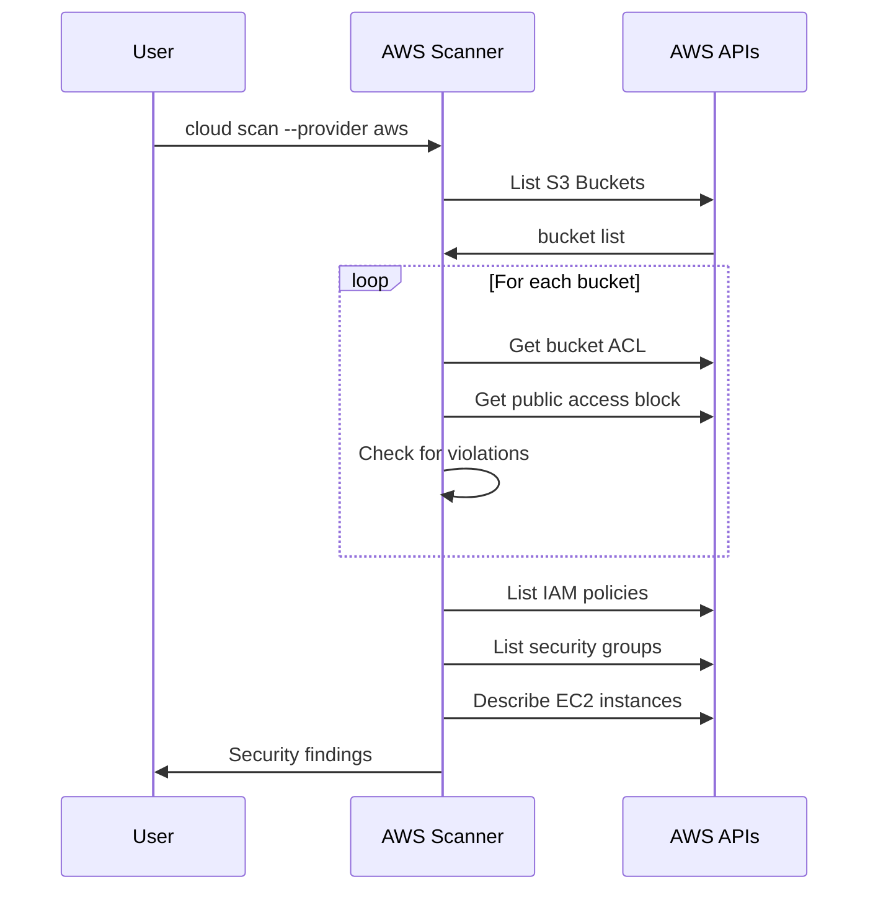

### Example Findings

**Public S3 Bucket:**
```
┌─────────────────────────────────────────────────────────────┐
│ 🔴 CRITICAL: Public S3 Bucket                               │
├─────────────────────────────────────────────────────────────┤
│ Resource: arn:aws:s3:::my-data-bucket                       │
│                                                             │
│ This bucket is publicly accessible. Anyone on the           │
│ internet can read its contents.                             │
│                                                             │
│ Remediation:                                                │
│ 1. Enable "Block Public Access" in bucket settings          │
│ 2. Review and update bucket policy                          │
│ 3. Audit existing objects for sensitive data                │
└─────────────────────────────────────────────────────────────┘
```

### Command Line

```bash
# Scan all AWS services
secureagent cloud scan --provider aws

# Scan specific services
secureagent cloud aws s3
secureagent cloud aws iam
secureagent cloud aws ec2
```

---

## Azure Scanner

Scans your Azure subscription for security issues.

### What It Scans

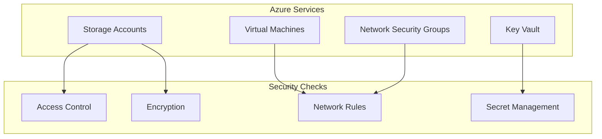

### Security Rules

| Rule ID | Name | Severity | Description |
|---------|------|----------|-------------|
| AZURE-STOR-001 | Public Container | CRITICAL | Container allows public access |
| AZURE-STOR-002 | HTTP Allowed | HIGH | HTTPS not enforced |
| AZURE-KV-001 | No Soft Delete | MEDIUM | Key Vault recovery disabled |
| AZURE-NSG-001 | Open Inbound | HIGH | NSG allows all inbound |

### Command Line

```bash
# Scan Azure resources
secureagent cloud scan --provider azure

# Scan specific services
secureagent cloud azure storage
```

---

## Terraform Scanner

Scans Infrastructure as Code (IaC) for security issues before deployment.

### What It Scans

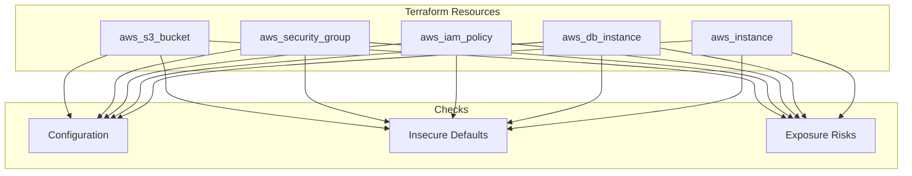

### Why Scan Terraform?

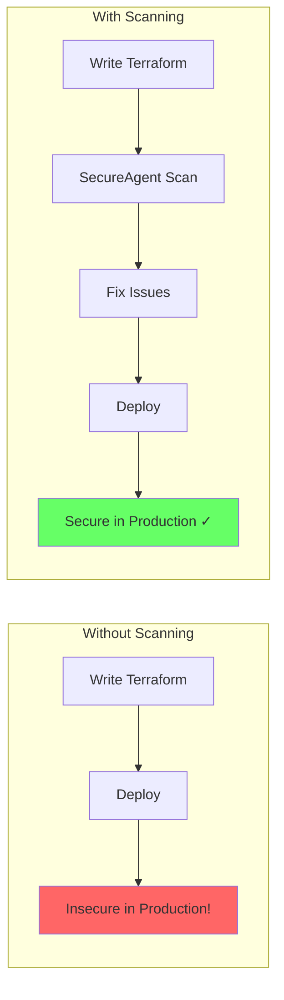

### Security Rules

| Rule ID | Name | Severity | Description |
|---------|------|----------|-------------|
| TF-S3-001 | Public Bucket | CRITICAL | S3 bucket allows public access |
| TF-SG-001 | Open Security Group | HIGH | SG allows 0.0.0.0/0 |
| TF-SG-002 | SSH From Internet | CRITICAL | Port 22 open to all |
| TF-SG-003 | All Traffic | CRITICAL | Protocol -1 (all) allowed |
| TF-RDS-001 | Public RDS | CRITICAL | Database publicly accessible |
| TF-EC2-001 | No IMDSv2 | MEDIUM | Instance metadata not secured |
| TF-EC2-002 | Unencrypted EBS | MEDIUM | EBS volume not encrypted |

### Example Findings

**Insecure Security Group:**
```hcl
resource "aws_security_group" "web" {
  ingress {
    from_port   = 22
    to_port     = 22
    protocol    = "tcp"
    cidr_blocks = ["0.0.0.0/0"]  # ❌ SSH open to world!
  }
}
```

**Fix:**
```hcl
cidr_blocks = ["10.0.0.0/8"]  # ✓ Internal only
```

### Command Line

```bash
# Scan Terraform files
secureagent scan ./terraform --scanners terraform

# Scan specific file
secureagent scan ./main.tf --scanners terraform
```

---

## Scanner Comparison

### When to Use Each Scanner

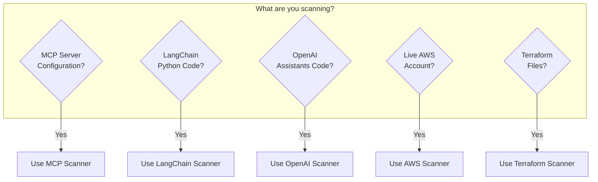

### Feature Comparison

| Feature | MCP | LangChain | OpenAI | AWS | Azure | Terraform |
|---------|-----|-----------|--------|-----|-------|-----------|
| Credential Detection | ✓ | ✓ | ✓ | - | - | - |
| Command Injection | ✓ | ✓ | - | - | - | - |
| Network Exposure | - | - | - | ✓ | ✓ | ✓ |
| IAM Analysis | - | - | - | ✓ | ✓ | ✓ |
| Encryption Check | - | - | - | ✓ | ✓ | ✓ |
| Tool Analysis | ✓ | ✓ | ✓ | - | - | - |
| Auto-Fix | ✓ | - | - | - | - | - |

---

## Creating Custom Scanners

See [Architecture](architecture.md#plugin-system) for details on creating custom scanners.

```python
from secureagent.core.scanner.base import BaseScanner
from secureagent.core.models.finding import Finding

class CustomScanner(BaseScanner):
    name = "custom"
    description = "My custom scanner"

    def scan(self, target: str) -> List[Finding]:
        findings = []
        # Your scanning logic here
        return findings
```

---

## Next Steps

- [CLI Reference](cli-reference.md) - Complete command documentation
- [Compliance](compliance.md) - How findings map to standards
- [Integrations](integrations.md) - CI/CD integration
